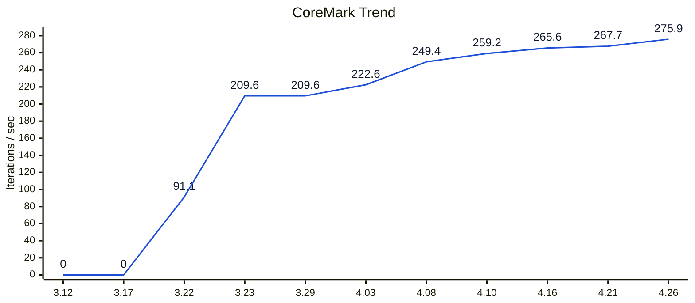
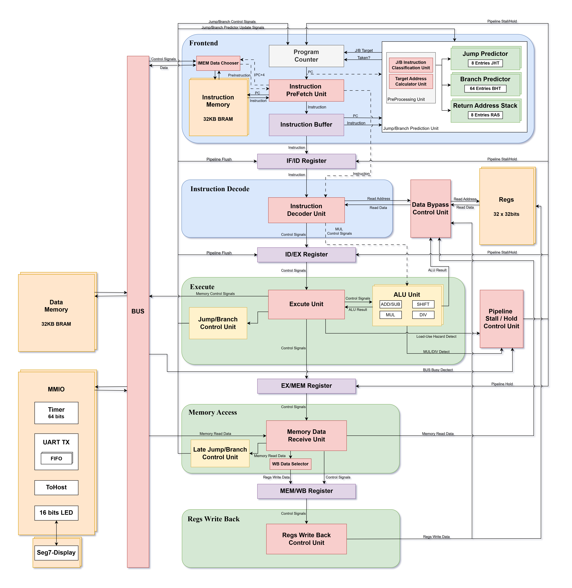

# SXQ-RV32IM-CPU
Board: `xc7a100tcsg324-1` (Artix-7)

## Project Overview
本项目面向 FPGA 平台实现一颗自研的 `RV32IM` 处理器，探索适用于真实场景中小型设备的前端、控制流处理和数据相关处理优化方法，形成一种在较低资源开销下实现更高性能的 CPU 设计方案。项目覆盖从微架构设计、Verilog 建模、仿真验证到 FPGA 落地实现的完整流程。

当前版本是一颗工作在 `100MHz` 下的 `RV32IM` 单发射准六级流水线 CPU。上板 CoreMark 达到 `275.9 Iterations / sec`，LUT 消耗为 `3581`，动态功耗为 `0.231W`，热裕量达到 `58.5 degC`，基本实现了小面积、低功耗、高性能的设计目标。

## Key Innovations
- **动态压缩前端机制**：以 `PREIF-IF-ID-EX-MEM-WB` 准六级流水线为基础，利用双口 BRAM 特性实现前端在五级与六级形态之间的动态切换，在较小资源代价下支持 IF 阶段获得指令信息。
- **低资源跳转分支预测机制**：在不引入复杂 ICache 或大容量 BTB 的前提下，将指令本身纳入预测输入，并按控制流类型拆分预测路径。
- **针对分支跳转指令的 Load-Use 晚转发**：对依赖前一条 `LOAD` 的 Branch / `JALR` 指令定向后移解析，减少控制相关场景中的固定 stall 损失。
- **IMEM 与 DMEM 访存前移**：针对 BRAM 同步读带来的一拍延迟，将 IMEM 访问前移到 PreIF，将 DMEM 访问前移到 EX，压缩访存等待周期。
- **乘法器操作数前移**：采用 FPGA DSP 资源实现 `MUL` 相关指令，并将乘法操作数准备前移一拍，降低分周期乘法器对流水线的阻塞影响。

| Control Flow Type | Direction Prediction | Target Prediction |
| --- | --- | --- |
| `JAL` | Always Taken | Direct `PC + IMM` |
| `JALR` | Always Taken | JTB / RAS |
| Branch | BHT (2BC) / BTFNT | Direct `PC + IMM` |

## Current Key Metrics
CoreMark 分数来自 `ITERATIONS=5000` 的实际上板 UART 输出；周期数、退役指令数、IPC 和跳转分支预测准确率来自 `ITERATIONS=1` 的 Vivado 仿真统计。

| Category | Metric | Result |
| --- | --- | --- |
| Platform | FPGA Device | `xc7a100tcsg324-1` |
| Platform | Clock | `100MHz` |
| Resource | LUT / FF / BRAM / DSP | `3581 / 2741 / 16 / 4` |
| Performance | CoreMark | `275.9 Iterations / sec` |
| Performance | CoreMark / MHz | `2.759 Iterations / MHz` |
| Performance | Dhrystone | `166000 Dhrystones / sec` |
| Performance | DMIPS / MHz | `0.945` |
| Performance | Embench-WikiSort | `121.84` |
| IPC | CoreMark / Dhrystone / Embench | `0.851 / 0.907 / 0.790` |
| Power | Total / Dynamic / Static | `0.329W / 0.231W / 0.099W` |
| Thermal | Junction / Margin | `26.5 degC / 58.5 degC` |
| Prediction | Overall Accuracy | `88.43%` |
| Prediction | JAL Direction / Target | `100.00% / 100.00%` |
| Prediction | JALR Direction / Target | `100.00% / 99.91%` |
| Prediction | Branch Direction / Target | `87.06% / 100.00%` |

## Version History

***Version 3.12*** || CoreMark = **000.0 Iterations / sec** || **100MHz** || WNS **0.894ns** WHS **0.105ns** \
***Version 3.17*** || CoreMark = **000.0 Iterations / sec** || **100MHz** || WNS **0.977ns** WHS **0.141ns** \
***Version 3.22*** || CoreMark = **091.1 Iterations / sec** || **100MHz** || WNS **1.015ns** WHS **0.310ns** || LUT: **1775**

***Version 3.23*** || CoreMark = **209.6 Iterations / sec** || **100MHz** || WNS **0.789ns** WHS **0.053ns** || LUT: **2404** \
- CoreMark 1.0 首次稳定跑通，并引入基于 `DSP48E1` 的乘法器与 `UART_TX`。

***Version 3.29*** || CoreMark = **209.6 Iterations / sec** || **100MHz** || WNS **0.930ns** WHS **0.022ns** || LUT: **2078** \
- 增加 `preif` 逻辑，利用压缩前端机制在 IF 阶段更早拿到指令，并同步做了一轮时序优化。

***Version 4.03*** || CoreMark = **222.6 Iterations / sec** || **100MHz** || WNS **0.637ns** WHS **0.086ns** || LUT: **2017** \
- 调整访存相关路径，使部分读写操作在 MEM 阶段即可完成，并重整相应的 `pipeline stall` 机制。

***Version 4.08*** || CoreMark = **249.4 Iterations / sec** || **100MHz** || WNS **0.712ns** WHS **0.045ns** || LUT: **2785** \
- 新增 `Bimodal Branch Predictor`（`Entry = 16`，`Index = 4 bits`），继续优化前端时序。

***Version 4.10*** || CoreMark = **259.2 Iterations / sec** || **100MHz** || WNS **0.119ns** WHS **0.075ns** || LUT: **3257** \
- 继续优化分支预测，并加入跳转预测；此版本主要用于功能验证与阶段性收敛。

***Version 4.16*** || CoreMark = **265.6 Iterations / sec** || **100MHz** || WNS **0.025ns** WHS **0.066ns** || LUT: **2632** \
- 修正分支预测与预取机制，并将 `mul` 的部分操作数准备前移到 ID 阶段。

***Version 4.21*** || CoreMark = **267.7 Iterations / sec** || **100MHz** || WNS **0.024ns** WHS **0.084ns** || LUT: **3247** \
- 增加面向 `RV32IM` 的多拍迭代除法器，支持 `DIV / DIVU / REM / REMU`；同时将 `Bimodal Branch Predictor` 扩展到 `64` 项，并把相关配置统一收敛到 `defines.v`。

***Version 4.26*** || CoreMark = **275.9 Iterations / sec** || **100MHz** || WNS **0.050ns** WHS **0.142ns** || LUT: **3581** || FF: **2741** || BRAM: **16** || DSP: **4** \
- 拆分并模块化控制路径，新增 ctrl_late_detect 与 mem_ctrl_resolve，整理前后级控制接口。
- 加入只针对 J/B 控制指令的晚转发：当分支或 JALR 依赖前一条 LOAD 结果时，在 ID 标记 defer，并将比较、方向判定与 JALR 目标计算后移到 MEM 完成。
- 当前 benchmark 结果：`CoreMark = 275.921925 Iter/s`，`Dhrystone = 166000 Dhrystones/s`，`Embench-WikiSort = 121.84`。
- 当前 `CoreMark` 正式配置使用 `-march=rv32im -mabi=ilp32 -mstrict-align -O2`，并按硬件 `RV32IM` 路径运行。

## CoreMark Trend

## Version 4.26 Summary
### CPU Architecture

### Benchmark Summary

Raw logs: `docs/benchmark_raw_results.md`

| Benchmark | Build Flags / Config | Score | IPC | Cycles (`C`) | Instret (`I`) | Extra |
| --- | --- | --- | --- | ---: | ---: | --- |
| CoreMark | `-march=rv32im -mabi=ilp32 -mstrict-align -O2` ; `ITERATIONS=5000` | `275.921925 Iter/s` | `0.851` | `362458` | `308288` | `18.121068 s`, valid run |
| Dhrystone | `-march=rv32im -mabi=ilp32 -mstrict-align -O2 -std=gnu89` ; `DHRY_HZ=100000000` ; `1800 runs` | `166000 Dhrystones/s` | `0.907` | `1081810` | `980993` | `6 us/run`, `0.945 DMIPS/MHz` |
| Embench-WikiSort | `-march=rv32im -mabi=ilp32 -mstrict-align -O2 -std=gnu11` ; `GLOBAL_SCALE_FACTOR=1` ; `WARMUP_HEAT=1` | `121.84` | `0.790` | `2972710` | `2347271` | `WS V=1` |

| Item | Value |
| --- | --- |
| FPGA Device | xc7a100tcsg324-1 |
| Clock | 100MHz |
| CoreMark | 275.921925 Iterations / sec |
| Dhrystone | 166000 Dhrystones / sec |
| Embench-WikiSort | 121.84 |
| DMIPS/MHz | 0.945 |
| WNS / WHS | 0.050ns / 0.142ns |
| LUT / FF / BRAM / DSP | 3581 / 2741 / 16 / 4 |
